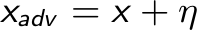
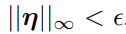
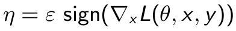
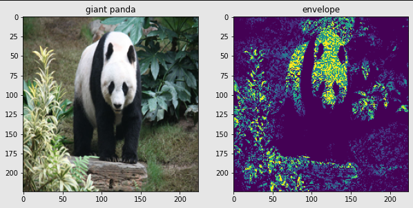
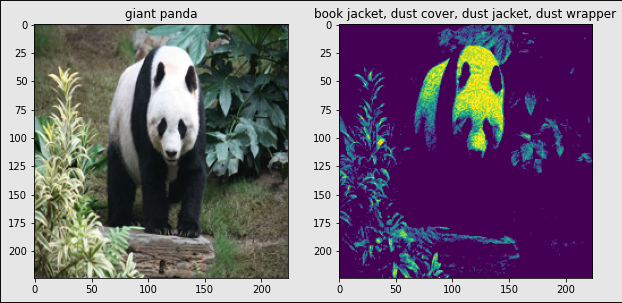
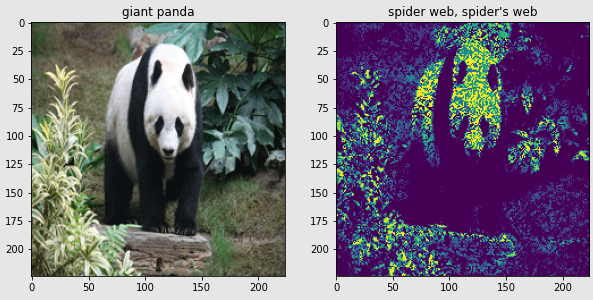
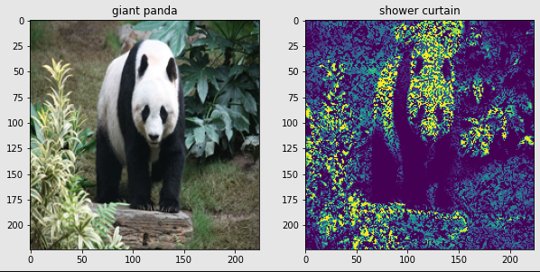

# Pytorch Implementation of FGSM
***
## Usage
```
python3 fgsm.py
```
***
## Help Log
```
usage: fgsm.py [-h] [--img_src IMAGE SOURCE] [--eps Epsilon]
                               
optional arguments:
  -h, --help         show this help message and exit
  --img_src IMG_SRC  img src
  --eps EPS          eps
  
```
***
## Contributed by:
* [Ujwal Kumar](https://github.com/ujwalk04)
***

## Reference :
***
* **Title** : Explaining and Harnessing Adversarial Examples
* **Link** : https://arxiv.org/abs/1412.6572
* **Author** : Ian J. Goodfellow, Jonathon Shlens, Christian Szegedy
* **Tags** : Neural Network , Computer Vision and Pattern Recognition
* **Published** : 20 March , 2015
***

## Summary:
***
## Introduction:
***
Recent years have seen a rapid increase in the use of machine learning & deep neural networks , through which computers can be programmed to identify patterns in information and make increasingly accurate predictions over time. Deep learning models are found to be vulnerable to something called adversarial examples. Adversarial example is an intentionally designed input which is not much different from original input but is misclassfied by the model. For example, if we have one image which is correctly classified by our ResNet50 model, then we can use some method to generate adversarial example of this image which is visually similar to the original one but it is misclassified by the same model. Adversarial examples also helps the model to learn more effectively . The adversarial examples expose fundamental blind spots in our training algorithms. A number of defence mechanisms against such inputs have also been proposed over time.
***

## Overview
***
To create an adversial example , we add an adversial perturbation to the original input .


The magnitude of the added perturbation is also constrained as :

where &epsilon is a small floating point number .
The perturbation constant is given as :


In the formula :
- **ε**: floating point numbers which are intentionally kept small so that there are less differences between the example and the original image .
- **sign(gradients)** : gives the sign of the gradients computed while predicting the image.

Fast Gradient Sign Method (FGSM) is a fast and computationally efficient method to generate adversarial examples . So , we apply the formula for calculating adversarial examples and observe the wrongly predicted class of the adversarial example .
 
***

## Example 
***
Following are few examples with different values of ε (both high and low) used . The title of the image represents its class in accordance to the imagenet classes .

- **ε =0.5**




- **ε =0.1**




- **ε =0.54**




- **ε =0.76**



***
