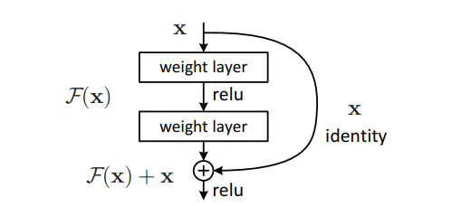
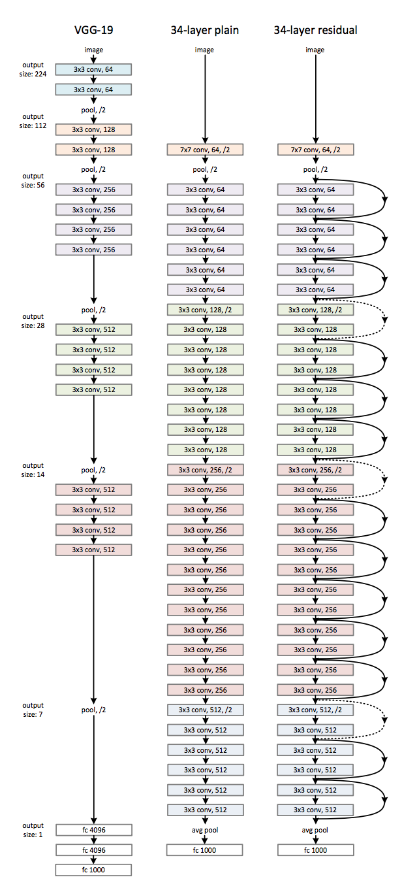
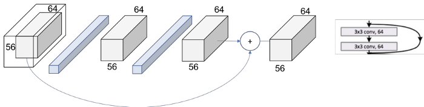
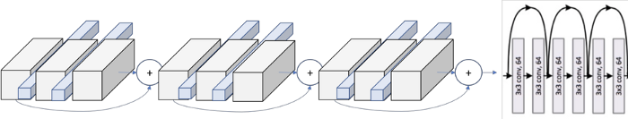
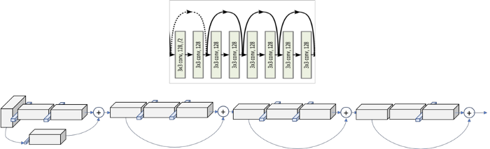
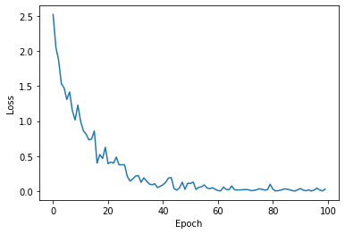
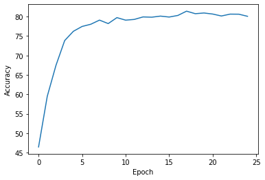

# Pytorch Implementation Of Resnet
***
## Usage:
```
$ python3 train.py
```

## Help Log:
```
usage: train.py [-h] [--learning_rate LEARNING_RATE] [--n_epoch N_EPOCH] [--batch_size BATCH_SIZE] [--momentum MOMENTUM]

optional arguments:
  -h, --help            show this help message and exit
  --learning_rate LEARNING_RATE
                        learning rate for the model
  --n_epoch N_EPOCH     number of epoch
  --batch_size BATCH_SIZE
                        # of batch size
  --momentum MOMENTUM   momentum for optimization
```

## Contributed by:
* [Ujwal Kumar](https://github.com/ujwalk04)
***
## Reference :
***
* **Title** : Deep Residual Learning for Image Recognition : Resnet
* **Link** : https://arxiv.org/pdf/1512.03385.pdf
* **Author** : Kaiming He , Xiangyu Zhang , Shaoqing Ren , Jian Sun
* **Tags** : Neural Network , Computer Vision and Pattern Recognition
* **Published** : 10 December , 2015
***
# Summary:
***
## Introduction:
Researchers observed that it makes sense to claim , deeper the network ; better the network. Recent evidence reveals that network depth is of crucial importance , specially when it comes to convolutional neural networks . When deeper networks are able to start converging, a degradation problem has been exposed: with the network
depth increasing, accuracy gets saturated (which might be unsurprising) and then degrades rapidly. Hence , adding more layers to a suitably deep model leads to higher training error . We address the degradation problem by introducing a deep residual learning framework . These networks also solve the problem of **vanishing gradient .** This is because when the network is too deep, the gradients from where the loss function is calculated easily shrink to zero after several applications of the chain rule. 
With ResNets, the gradients can flow directly through the skip connections backwards from later layers to initial filters.

***

## Architecture:
The network is linked with the identity function , i.e. 
```
f(x)=x

```


The input is added to the first layer of the model to be the output of the last layer of the model, the network should be able to predict whatever function it was learning before with the input added to it. Now, the gradients can flow directly using these skip connections.



The first step before entering into the layers is applying a covolution -> batch normalising -> maxpool . In the convolution operation , kernel of size 7 is used and a feature map size of 64 with a padding of 3. After this operation our input image converts into (112x112x64) . Then batch normalisation acts upon each element unaffecting the size . After this we have a maxpool operation (3x3) with a stride of 2 , converting the image to (56x56x64) .

Now we get into Resnet layers , where we observe a repetitve object , called as block consisting of some operations. Hence layers are composed of several blocks .
The following figure depicts the operations in a block :



Here , the output size remains 56x56 since padding and stride both are 1. 
The following layer depicts a complete [3x3,64] x3 times within the layer.



We can also see the dot layer representing the change of the dimensionality. The first operation of each layer is reducing the dimension, so we also need to resize the volume that goes through the skip connection, so that we could add them to perform our further operations . The volume can be modified , either by increasing the stride to 2 or rather increasing the padding and perform convolutions .
The following pictures shows the complete layer consisting of both types of blocks :



## Results

**Default values used in Training Model**

* Learning rate - 0.01
* Momentum - 0.9
* Number of epochs - 25
* Batch_size - 128
* DataSet - CIFAR10

**Loss graph of whole dataSet**



***

**Accuracy plot**



### The accuracy obtained is 80.05%

By adjusting values of learning rate and number of epoches , better accuracy can be obtained .
