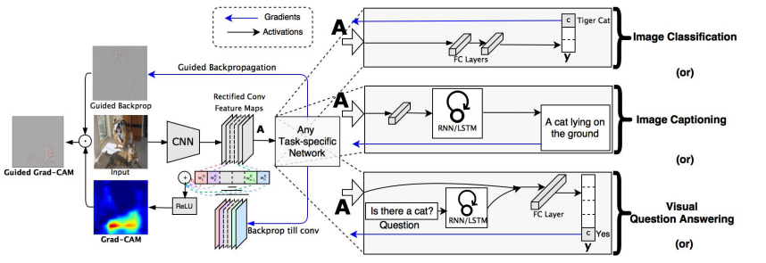
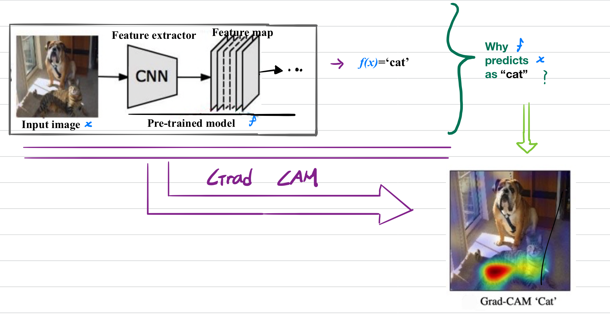
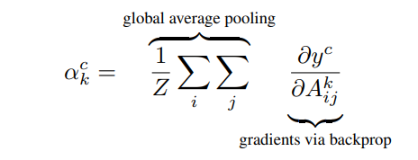
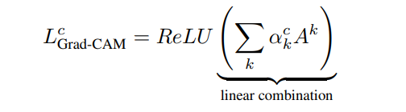
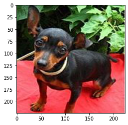
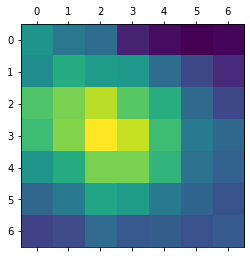
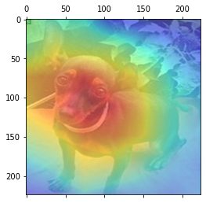

# Pytorch Implementation of GradCAM
***
## Usage
```
python3 gradcam.py
```
***
## Help Log
```
Usage: ipykernel_launcher.py [-h] [--img_src IMAGE SOURCE]
                               
optional arguments:
  -h, --help            show this help message and exit
  --img_src             IMAGE SOURCE
  
```
***
## Contributed by:
* [Ujwal Kumar](https://github.com/ujwalk04)
***

## Reference :
***
* **Title** : Grad-CAM: Visual Explanations from Deep Networks via Gradient-based Localization
* **Link** :  https://arxiv.org/abs/1610.02391
* **Author** : Ramprasaath R. Selvaraju, Michael Cogswell, Abhishek Das, Ramakrishna Vedantam, Devi Parikh, Dhruv Batra
* **Tags** : Neural Network , Computer Vision and Pattern Recognition
* **Published** : 3 December , 2019
***

## Summary:
***
## Introduction:
Convolutional Neural Networks(CNNs) and other deep learning networks have enabled unprecedented breakthroughs in a variety of computer vision tasks from image classification to object detection, semantic segmentation, image captioning and more recently visual question answering. While these networks enable superior performance, their lack of decomposability into intuitive and understandable components makes them hard to interpret. Consequently, when today’s intelligent systems fail, they fail spectacularly disgracefully without warning or explanation, leaving a user staring at an incoherent output, wondering what exactly happened.

In order to build trust in intelligent systems and move towards their meaningful integration into our everyday lives, it is clear that we must build transparent models that have the ability to explain why they predict what they predict .

***

## Architecture:
***
Overview:



The goal of GradCAM is to produce a coarse localization map highlighting the important regions in the image for predicting the concept (class).


The overall process in GradCAM can be summarised as :
* Find the last convolution layer
* Find the predicted class
* Obtain the gradients of the class with respect to the features
* Pooling the gradients obtained
* Weight the channels of the map by the corresponding pooled gradients
* Plot the heat map.

Grad-CAM uses the gradient information flowing into the
last convolutional layer of the CNN to assign importance
values to each neuron . This is because it is expected that the last convolution layer to have the best comprise between high-level semantics and detailed spatial information. 
We first compute the gradient of the score for class c, y<sup>c</sup>
(before the softmax), with respect to feature map activations A<sub>k</sub> of a convolutional layer, i.e. 
```
∂yc/∂Ak .
```
These gradients flowing back are global-average-pooled over the width and height dimensions (indexed by i and j respectively) to obtain the neuron importance weights α<sub>k</sub><sup>c</sup> .


Now , we perform a weighted combination of the obtained weights and then apply ReLU over it. The reason of applying ReLU is that we are only interested in the features that have a positive influence.


***
## Example:
The input image to our pretrained ResNet model :



The heatmap produced :



Superimposing the heatmap over the base image :



***

